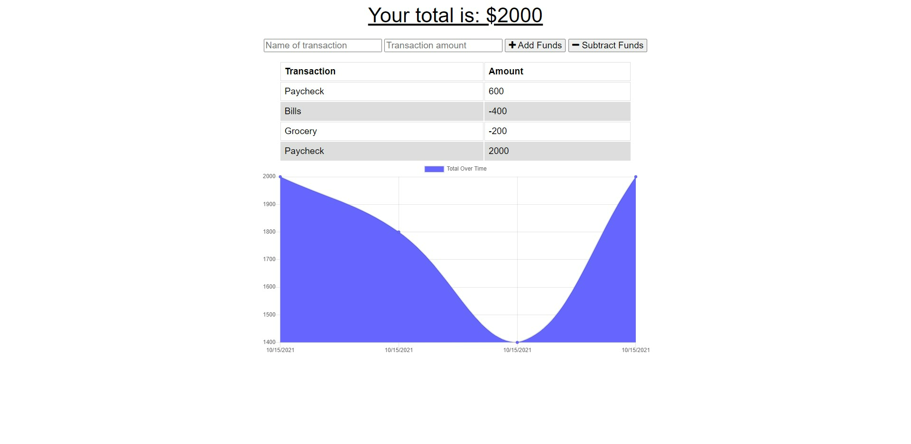

# Online Offline Budget Tracker

[Link to live site!](https://salty-cliffs-88868.herokuapp.com/)
    
## Description
Use this application to keep track of your budget wether you are online or offline.

## Table of Contents
- [Usage](#Usage)
- [Installation](#Installation)
- [Usage](#Usage)
- [Contributing](#Contributing)
- [Tutorial](#Tutorial)
- [Screenshot](#Screenshot)
- [License](#License)
- [Questions](#Questions)

## Usage
Click the link to navigate to the websit for your budget tracker!  You can use this tracker to imput money thats is coming in or leaving your baseline account balance.

## Installation
All you need to do for this application is navigate to the site link provided above.  If you would like to open the file in VS Code, you will need to run an 'npm install' and 'npm start' to run as localhost://3000. 

## Contributing 
Ashby Blakely 

## Screenshot

## License
MIT

## Questions
[Link to GitHub Profile](https://github.com/AshbyLB) 
Feel free to email me at ashbyleeblakely@gmail.com if you have any questions.

